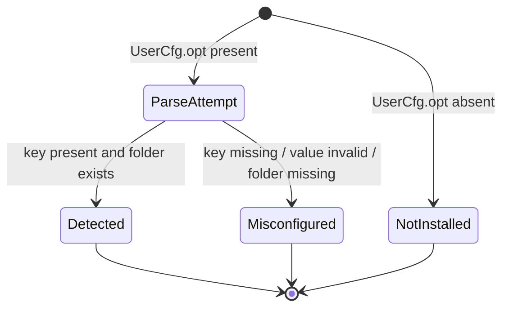
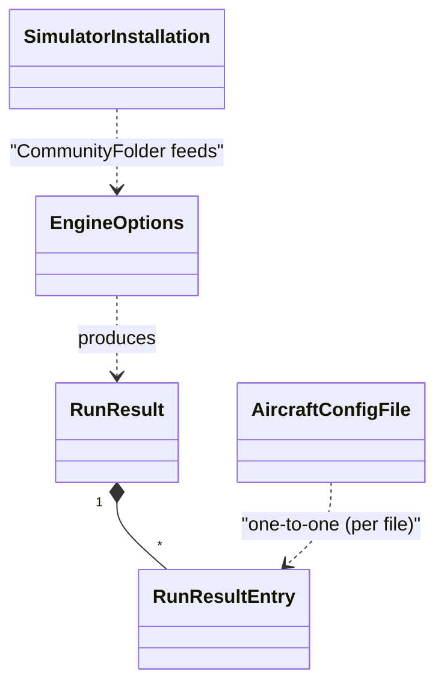

# Phase 1 Data Model: Pushback App

**Feature**: [spec.md](spec.md) · **Plan**: [plan.md](plan.md) ·
**Research**: [research.md](research.md)

This is a local utility, so the "data model" is in-memory record types
(modelled as PowerShell `[pscustomobject]` shapes) plus the two external
file formats it reads. Persistence is limited to log entries and `.bak`
files; no database.

## Entities

### 1. `SimulatorInstallation`

Represents one detected (or attempted) MSFS install.

| Field | Type | Notes |
|---|---|---|
| `Id` | string | Stable key. One of `MSFS2020`, `MSFS2024`. |
| `DisplayName` | string | Human label. `MSFS 2020`, `MSFS 2024`. |
| `UserCfgPath` | string | Absolute path the detector probed. |
| `UserCfgExists` | bool | `Test-Path` result for `UserCfgPath`. |
| `InstalledPackagesPath` | string? | Raw parsed value, or `$null` if missing / commented / unparseable. |
| `CommunityFolder` | string? | `Join-Path $InstalledPackagesPath 'Community'`, or `$null`. |
| `Status` | enum | `Detected` \| `NotInstalled` \| `Misconfigured` (see state diagram below). |
| `StatusDetail` | string | Human-readable explanation when `Status ≠ Detected`. |

#### Validation rules

- If `UserCfgExists` is false → `Status = NotInstalled`.
- If `UserCfgExists` is true and `InstalledPackagesPath` is null →
  `Status = Misconfigured` with `StatusDetail = "InstalledPackagesPath missing or commented out"`.
- If `CommunityFolder` is not null but does not exist on disk →
  `Status = Misconfigured` with `StatusDetail = "Community folder not found at <path>"`.
- Only `Status = Detected` is allowed as the target of any action button.

#### State diagram



The state is computed once per detection pass and is never mutated after
that — the user "switching sim" creates a new selection over the same set
of records; it does not mutate them.

---

### 2. `AircraftConfigFile`

Represents one `aircraft.cfg` discovered under a target Community folder.
Used only inside a single engine run; not persisted.

| Field | Type | Notes |
|---|---|---|
| `FullPath` | string | Absolute path. |
| `RelativePath` | string | Path relative to the target Community folder, used for human-friendly display in the GUI results pane. |
| `MatchedLineIndex` | int? | 0-based index of the first line whose trimmed content equals the configured target line, or `$null` if no match. |
| `CurrentState` | enum | `PushbackOn` (matches `PUSHBACK = 1`), `PushbackOff` (matches `PUSHBACK = 0`), `Other` (neither line present). |
| `HasExistingBackup` | bool | `Test-Path "$FullPath.bak"`. |

#### Validation rules

- The engine MUST read each file once and compute all four derived fields
  in a single pass (constitution Principle IV).
- `RelativePath` MUST be computed against the same Community-folder root
  the engine was invoked with, never re-discovered per file.

---

### 3. `RunResult`

The outcome of a single user-initiated action. Returned by the engine to
the GUI and serialised, line-by-line, to the log file.

| Field | Type | Notes |
|---|---|---|
| `Action` | enum | `DisablePushback` \| `EnablePushback` \| `DryRun` \| `RestoreBackups`. |
| `TargetSim` | string | `SimulatorInstallation.DisplayName` of the chosen sim, or `Custom` when set via Browse… |
| `TargetCommunityFolder` | string | Absolute path actually walked. |
| `LogPath` | string | Absolute path of the log file written. |
| `StartedAt` | datetime | UTC timestamp written into log header. |
| `FinishedAt` | datetime | UTC timestamp written into log footer. |
| `Counts.Changed` | int | Files modified (always 0 for `DryRun`). |
| `Counts.WouldChange` | int | Files that would have been modified (always 0 for non-`DryRun`). |
| `Counts.Unchanged` | int | Files whose `CurrentState` already matched the desired state, or did not contain the target line. |
| `Counts.Errors` | int | Files that produced an `ERROR` log entry. |
| `Entries` | `RunResultEntry[]` | One per file processed; backs the expandable GUI lists. |
| `CancelledByUser` | bool | True if the run finished early because the user clicked **Cancel**. |
| `OverwroteExistingBackups` | bool | True if any existing `.bak` was overwritten under explicit opt-in. False otherwise. |

#### Invariant

`Counts.Changed + Counts.WouldChange + Counts.Unchanged + Counts.Errors`
**MUST equal** `Entries.Count` (or, if `CancelledByUser`, equal the count
of files processed before cancellation). The GUI summary panel validates
this invariant before rendering — a mismatch indicates a bug per SC-004.

---

### 4. `RunResultEntry`

One file-level result.

| Field | Type | Notes |
|---|---|---|
| `FullPath` | string | Absolute path of the file. |
| `State` | enum | `CHANGED` \| `WOULD CHANGE` \| `NO CHANGE` \| `ERROR`. |
| `ErrorMessage` | string? | Set only when `State = ERROR`; matches FR-022 format (file + operation + remediation). |

#### Mapping to log lines

The engine writes one line per entry into the log file using the grammar
defined in [contracts/log-format.md](contracts/log-format.md). The
in-memory entry and the log line MUST be 1:1 — never split, never merged.

---

### 5. `EngineOptions`

The full parameter set of `Invoke-PushbackEngine`. Captured as an entity
because it is the public contract the GUI binds to and the CLI exposes.
Authoritative shape defined in [contracts/engine-cli.md](contracts/engine-cli.md);
summarised here:

| Field | Type | Default | Notes |
|---|---|---|---|
| `CommunityFolder` | string | _required_ | Absolute path; MUST exist. |
| `Action` | enum | _required_ | `DisablePushback` / `EnablePushback` / `DryRun` / `RestoreBackups`. |
| `TargetLineOn` | string | `PUSHBACK = 1` | Configurable; satisfies Principle I (no hard-coding). |
| `TargetLineOff` | string | `PUSHBACK = 0` | Configurable. |
| `LogPath` | string | `$env:LOCALAPPDATA\Pushback\pushback.log` | Configurable. |
| `OverwriteExistingBackups` | bool | `$false` | NON-NEGOTIABLE: must be explicit per Principle II + FR-016. |
| `CancelFlag` | `[ref]` | `$null` | Polled between files for cooperative cancel. |
| `ProgressCallback` | `[scriptblock]` | `$null` | Invoked after each file; receives `(processed, total, lastEntry)`. |

---

## External file formats (read-only inputs)

### `UserCfg.opt`

Plain text, ASCII / UTF-8. One key per line. Recognised forms for the
key we care about:

```text
InstalledPackagesPath "C:\MSFS"
InstalledPackagesPath C:\MSFS
   InstalledPackagesPath    "D:\Games\MSFS 2024"
; InstalledPackagesPath "C:\old"     ← comment, ignored
```

Full parsing rules and edge cases are in
[contracts/usercfg-parser.md](contracts/usercfg-parser.md).

### `aircraft.cfg`

Plain text, ASCII / UTF-8 / Windows-1252 (varies by mod). The engine
reads the file as text, identifies the first line whose trimmed content
exactly equals `TargetLineOn` or `TargetLineOff`, and rewrites only that
line. All other lines, including encoding-specific characters elsewhere
in the file, MUST be preserved byte-identically.

**Out of scope for v1**: multi-line `[PUSHBACK]` sections, whitespace
variants (`PUSHBACK=1`, `PUSHBACK =1`), or casing variants. Per
Assumptions in `spec.md`, the exact line `PUSHBACK = 1` matches FSLTL
output and is sufficient. A future iteration may relax this.

---

## Relationships



`SimulatorInstallation` instances are discovered by `Pushback.SimDetect.psm1`
and presented to the user; the user's selection becomes the
`CommunityFolder` field of `EngineOptions`. The engine then enumerates
`AircraftConfigFile` records and emits a matching `RunResultEntry` for
each, aggregated into a single `RunResult` returned to the caller.

## Persistence summary

| Data | Lives in memory | Persisted to disk |
|---|---|---|
| `SimulatorInstallation` | yes (session) | no |
| `AircraftConfigFile` | yes (run only) | no |
| `RunResult` | yes (session) | only via its log lines |
| `RunResultEntry` | yes (run + history pane) | one line each in the log |
| `EngineOptions` | yes (call only) | no |
| `aircraft.cfg` mutations | n/a | yes — in-place rewrite + sibling `.bak` |
